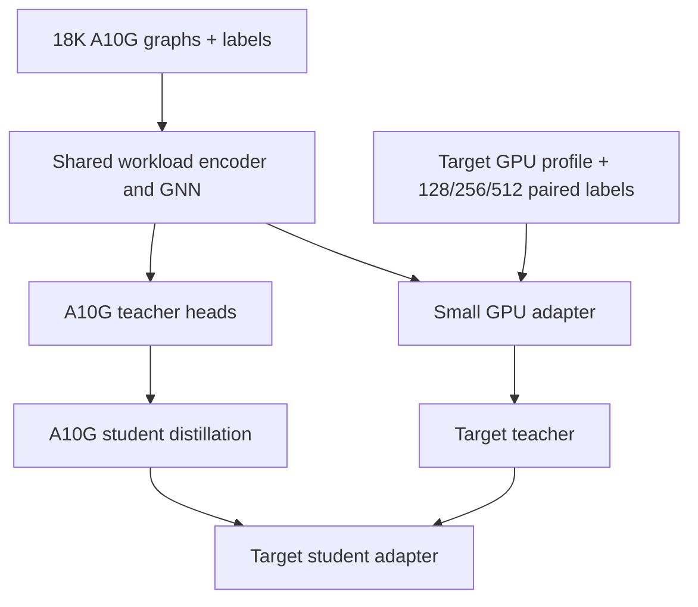

# PerfSeer v3 A10G-to-NVIDIA Transfer-Learning Refactor Plan

## Coding-agent goal

Refactor the implemented PerfSeer v3 teacher/student suite so that:

1. The full 18,000-configuration dataset labeled on NVIDIA A10G trains one
   reusable base teacher and one reusable base student.
2. A new concrete NVIDIA GPU does **not** require another 18K full-model
   labeling campaign or full model retraining.
3. A target GPU is supported by collecting a much smaller, paired and
   diversity-selected labeling subset, fitting a parameter-efficient hardware
   adapter, calibrating uncertainty/OOM outputs, and producing a GPU-specific
   teacher/student artifact pair.
4. The scheduler continues to fail closed on the wrong GPU, incompatible
   schema, unsupported capture, unsupported precision, or low confidence.
5. Every transfer claim is backed by grouped held-out evaluation and a label
   budget curve rather than by structural tests alone.

The target is **few-shot hardware transfer**, not unmeasured zero-shot
cross-GPU prediction. A10-only labels cannot identify how every workload
changes across architectures, memory systems, kernel libraries, tensor-core
generations, power limits, or driver/runtime versions. The base must therefore
learn hardware-independent workload structure, while a small target-GPU
adapter learns the device-specific response.

## Repository baseline audited on August 4, 2026

Repository: `JustinLinKK/PerfSeer-predictor`

Default branch: `v2`

Audited head: `ec36bdc39e6674f6b0dda2b0fed7895ebaf0cd95`

The coding agent must re-check the head before editing and report any newer
commits that change these findings.

### What is already implemented

- An isolated v3 package exists under `src/perfseer_v3`.
- The v3 encoder uses typed node, edge, and global hierarchical embeddings.
- The graph captures forward, loss, backward, and optimizer phases.
- The model exposes six scheduler outputs, uncertainty, OOM probability, OOM
  stage, confidence, peak-live bytes, graph embeddings, and phase embeddings.
- A deterministic A10G dataset pack defines exactly 18,000 successful
  configurations across 35 model families, 22 tasks, and 50 generated
  lineages.
- The A10G protocol uses five complete epochs: epochs 1-2 warm up and epochs
  3-5 provide the aggregated measurement. One successful run is retained per
  configuration.
- The repository includes T0/T1/T2 teacher and S0/S1/S2/S3 student capacity
  candidates.
- Dataset sharding, resumption, OOM repair, finalization, artifact integrity,
  runtime hardware checks, evaluation, and local unit tests are implemented.

### What is not complete

- The repository status report explicitly says the production A10G 18K labels
  have not yet been collected and no production v3 teacher/student pair has
  been trained or accuracy-validated.
- The checked-in operation registry remains `training_approved: false` until
  production GPU-time coverage is measured.
- Current `v3_teacher.yaml` selects T0 (`1024 x 8`), and current
  `v3_student.yaml` selects S0 (`192 x 2`), even though the capacity study
  provides the larger recommended T1 and S1 candidates.
- The implemented contract deliberately requires a separately trained full
  teacher/student pair for every GPU.

### Current transfer blockers

| Blocker | Current behavior | Required correction |
|---|---|---|
| Hardware-entangled global encoder | Hardware ID and hardware capacities are mixed into the global state before message passing | Split workload encoding from hardware conditioning |
| A10-only hardware normalization | Hardware fields are constant in the A10 training split and target values are clipped to the A10 quantiles | Use a versioned fixed/reference hardware normalizer outside the workload normalizer |
| Unseen GPU embedding | A new GPU hashes to an untrained random embedding bucket | Initialize from the A10 identity or derive it from a hardware profile; never use a random unseen bucket in production |
| Full-pair-per-GPU manifest rule | Teacher/student distillation is limited to one independently trained target GPU pair | Preserve one-GPU deployment artifacts but permit explicit base-to-target adaptation lineage |
| Absolute-label learning | The target model would relearn six absolute metrics from a small dataset | Learn paired A10-to-target residuals or ratios |
| No target subset selector | The 18K pack is frozen for A10, but no deterministic small transfer subset exists | Select by grouped strata plus latent diversity and active learning |
| Calibration is output-only | Existing linear and temperature calibration cannot correct workload-dependent hardware differences | Add a low-rank/FiLM hardware adapter before the prediction heads |
| OOM evidence is weak | Successful configurations count toward the 18K quota; failed attempts are retained separately | Retain target OOM attempts and add deliberate memory-boundary probes |

## Target architecture



### 1. Shared workload backbone

The reusable backbone must contain only information that describes the
workload and training configuration:

- exact/family/hash operation identities;
- tensor shape, dtype, layout, rank, alias, liveness, and fan-out;
- forward/loss/backward/optimizer phase;
- FLOPs, bytes, workspace, saved tensors, optimizer state, and topology;
- precision policy;
- optimizer and scheduler identity and hyperparameters;
- batch size, accumulation, checkpointing, clipping, and loss scaling;
- capture quality and unknown/custom fractions.

Do not inject a categorical GPU ID into the reusable message-passing trunk.
Otherwise the trunk becomes an A10-specific function and an unseen target ID
has no learned meaning.

### 2. Separate hardware encoder

Create a small `HardwareProfileEncoderV3` after graph pooling. Its input should
contain two blocks.

Static hardware fields:

- VRAM capacity;
- SM count;
- compute capability;
- memory bandwidth;
- L2 cache size when available;
- peak FP32, TF32, FP16/BF16, FP8, and FP4 throughput when supported;
- tensor-core generation/capability flags;
- PCIe/NVLink class if relevant to the measured workload;
- configured power limit and maximum clocks;
- CUDA, cuDNN, PyTorch, Triton, and driver compatibility identifiers.

Measured hardware signature:

- launch latency;
- pointwise bandwidth;
- reduction bandwidth;
- host-to-device and device-to-device bandwidth if relevant;
- small/medium/large GEMM throughput;
- convolution throughput;
- scaled-dot-product attention throughput;
- optimizer update throughput;
- allocator/workspace behavior;
- mixed-precision tensor-core throughput.

Use approximately 32-64 cheap microbenchmarks. These are not substitutes for
the target model-label subset; they provide a stable initialization and reduce
the number of full-model labels needed.

### 3. Hardware adapter

Add a versioned adapter after the shared graph/phase pooling and before the
metric heads. Start with this minimal design:

```text
z_workload = shared_backbone(graph_without_hardware_identity)
h_gpu      = hardware_profile_encoder(static_specs, microbenchmark_signature)

gamma, beta = FiLM(h_gpu)
z_conditioned = gamma * LayerNorm(z_workload) + beta
z_target = z_conditioned + Up(SiLU(Down(z_conditioned))) * scale
```

Requirements:

- Initialize FiLM to `gamma = 1`, `beta = 0` for the A10 base.
- Initialize the low-rank residual to exact identity by zero-initializing the
  `Up` projection.
- Use rank 32 for the teacher starting point and rank 16 for the student.
- The base A10 training stage may train the A10 hardware encoder, but it must
  preserve a separable, explicit adapter boundary.
- For a new GPU, freeze node/edge encoders and all SeerBlocks first.
- The default target trainable set is the target hardware profile embedding,
  FiLM parameters, low-rank adapter, and final calibration parameters.
- Do not unfreeze the full heads or GNN until an ablation proves that the
  adapter-only model underfits at 512 labels.

### 4. Paired residual targets

The target adapter should predict how the same configuration changes from A10
to the target GPU. Do not relearn six raw outputs from scratch.

For positive unbounded targets, learn a log ratio:

```text
delta_time = log(target_epoch_ms + eps) - log(a10_epoch_ms + eps)
delta_peak_vram = log(target_peak_vram + eps) - log(a10_peak_vram + eps)
delta_reserved = log(target_reserved + eps) - log(a10_reserved + eps)
```

For bounded utilization targets, learn a logit residual after clipping to a
safe interval such as `[0.005, 0.995]`:

```text
delta_util = logit(target_util / 100) - logit(a10_util / 100)
```

Decode by applying the target residual to the base A10 prediction. This makes
the adapter focus on hardware response and allows a much smaller labeling set.

Do not force all outputs through one transform. Preserve separate transforms
for:

- epoch time;
- average SM utilization;
- p95 SM utilization;
- peak VRAM used;
- peak PyTorch reserved memory;
- peak memory-controller utilization.

OOM remains a separate classifier with target-specific temperature
calibration. Peak-live bytes and predicted VRAM/capacity ratio should enter the
OOM head directly.

## Target data strategy

### Base A10G corpus

Use the existing frozen 18K quota and collection protocol. Do not alter the
configuration identities after A10 labeling begins.

The coding agent must verify before training:

- exactly 18,000 accepted configurations;
- exactly 54,000 measured epoch records;
- no source-group or graph-signature leakage;
- all accepted rows measured on `nvidia_a10g_24gb_aws_g5`;
- operation GPU-time coverage approved;
- OOM, unstable, and quarantined attempts retained outside the successful-row
  quota;
- all dataset, split, schema, registry, and source hashes frozen.

### Target subset budgets

Use a staged budget rather than choosing one arbitrary subset size.

| Stage | Total full-model labels | Suggested split | Purpose |
|---|---:|---:|---|
| Pilot | 128 | 96 train / 16 validation / 16 test | Validate capture, paired labels, adapter convergence, and gross transfer |
| Default | 256 | 192 / 32 / 32 | First production candidate; 1.42% of 18K |
| Expanded | 512 | 384 / 64 / 64 | Use active learning to correct under-covered/error regions |
| Hard ceiling | 1,024 | 768 / 128 / 128 | If this fails acceptance, report transfer failure instead of silently approaching full retraining |

The split must remain grouped by source lineage/family and graph signature.
Never randomly split repeated variants of the same source across train,
validation, and test.

### Initial subset selection

Build `scripts/select_perfseer_v3_transfer_subset.py` using the final A10G
`accepted_labels.jsonl`, frozen target manifest, and base-teacher embeddings.

Selection must satisfy all of the following:

1. Preserve the original grouped split or create a new group-safe split.
2. Cover all major modalities: vision, NLP, audio, tabular, graph, and
   generated architectures.
3. Cover every precision policy intended for deployment.
4. Cover eager and compiled execution modes.
5. Cover light, standard, and heavy resource regimes.
6. Cover optimizer/scheduler combinations.
7. Include all high-cost operation families and custom/unknown-heavy graphs.
8. Include compute-bound, memory-bandwidth-bound, launch-bound, and
   capacity-bound workloads.
9. Include extreme batch sizes and activation-checkpointing configurations.
10. Use k-center, farthest-point, or D-optimal selection in the frozen A10
    teacher latent space after satisfying categorical quotas.

Do not select only by model family. Two configurations from the same family
can exercise very different compute/memory regimes, while two nominally
different models can be nearly identical in the encoder latent space.

### Active-learning expansion

After the 128-label pilot:

1. Fit the target teacher adapter.
2. Run it over the unmeasured A10 configuration pool using target hardware
   metadata.
3. Rank candidates by a composite score:

   ```text
   score = uncertainty
         + latent_distance_to_selected
         + underrepresented_stratum_bonus
         + memory_boundary_bonus
         + scheduler_decision_sensitivity
   ```

4. Add the next 128 labels to reach 256.
5. Repeat only if acceptance gates fail, reaching 512 and at most 1,024.

The test split must remain frozen and may never influence active selection.

### Target OOM and near-OOM protocol

The successful A10 configurations alone may not create enough OOM examples on
a larger target GPU. Add explicit target memory-boundary probes:

- allocate approximately 10-15% of the target budget to high-activation and
  high-workspace configurations;
- test the paired A10 batch size first;
- when safe and permitted by the frozen probe contract, increase batch size
  along a deterministic power-of-two ladder until the first target OOM or the
  configured ceiling;
- retain every OOM attempt with failure stage and allocator state;
- if a repaired smaller batch succeeds, retain both the failed original and
  the successful repair;
- do not discard OOM rows because they do not count toward the successful A10
  18K quota.

## Normalization refactor

The current train-quantile normalization is unsafe for transfer because the
A10 hardware fields have zero variance. A target GPU value will be clipped to
the A10 min/max and become indistinguishable from A10.

Refactor normalization into two independently versioned blocks.

### Workload normalization

- Fit only on the A10 training split.
- Include node, edge, graph, optimizer, scheduler, precision, and phase
  features.
- Freeze and reuse it unchanged for every target GPU.
- Bind its hash to base and adapted artifacts.

### Hardware normalization

- Use fixed log/reference transforms with meaningful physical scales rather
  than one-GPU empirical variance.
- Define explicit units for every field.
- Use broad, versioned bounds that cover supported NVIDIA generations.
- Add a missing-value mask for unavailable specifications.
- Normalize microbenchmark results relative to reference sizes or theoretical
  limits.
- Store the policy and hash separately from workload normalization.

The coding agent must bump the feature/normalization contract version if this
changes tensor semantics. Old untrained v3 artifacts must not load silently.

## Teacher/student capacity and training plan

### Capacity controls

Run these controls on the same grouped A10 split:

| Role | Control | Recommended start | Ceiling |
|---|---:|---:|---:|
| Base teacher | T0: `1024 x 8` | T1: `1280 x 10` | T2: `1536 x 10` only if T1 underfits |
| Base student | S0: `192 x 2` | S1: `224 x 2` | S2/S3 only if deployment gates allow |
| Teacher adapter | none/linear-only | rank 32 FiLM + low-rank | rank 64 only after underfit evidence |
| Student adapter | none/linear-only | rank 16 FiLM + low-rank | rank 32 only after underfit evidence |

The current repository capacity report gives approximately 259.8M parameters
for T1 and 2.44M for S1 before this transfer refactor. Recompute exact counts,
artifact sizes, and CPU latency after adding adapters. Do not copy the old
numbers into a new report.

### Stage A: hardware-independent encoder pretraining

Pretrain the shared node/edge/global workload encoders using all 18K graphs,
without using target-GPU labels.

Use multiple objectives:

- operation family prediction;
- exact operation prediction;
- FLOP/byte/workspace reconstruction;
- masked tensor shape/dtype/layout reconstruction;
- phase prediction;
- graph-signature contrastive learning across safe configuration variants;
- graph-level compute/memory regime classification.

This stage should explicitly exclude GPU ID from the backbone representation.

### Stage B: A10 base teacher

Train T0 and T1 from the pretrained encoder. Select T1 only if it gives a
statistically significant grouped held-out improvement relative to its cost.

Use:

- log-space/appropriate transformed regression for six metrics;
- heteroscedastic uncertainty;
- OOM and failure-stage losses;
- peak-live-memory loss;
- confidence calibration;
- family/domain balancing;
- early stopping on grouped validation error;
- a scheduler-decision-sensitive auxiliary loss if validated.

### Stage C: A10 base student

Distill S0 and S1 from the selected A10 teacher using:

- hard A10 labels;
- teacher metric predictions;
- uncertainty;
- OOM and failure-stage logits;
- graph-representation relational distillation;
- phase-representation relational distillation.

Select the smallest student passing accuracy, CPU latency, artifact size,
memory, and scheduler-integration gates.

### Stage D: target teacher adaptation

Initialize from the A10 teacher. Freeze:

- node encoder;
- edge encoder;
- workload global encoder;
- all SeerBlocks;
- phase pooling;
- base A10 metric heads initially.

Train only:

- target hardware profile embedding/encoder output;
- FiLM parameters;
- low-rank target adapter;
- paired residual output projection if separate;
- target uncertainty/OOM calibration.

Use adapter regularization and L2-SP toward the A10 identity. Stop on target
grouped validation error.

If 512 labels still show clear underfitting, compare these controlled
extensions one at a time:

1. unfreeze metric-head final linear layers;
2. unfreeze the last SeerBlock with a 10-100x smaller learning rate;
3. increase adapter rank;
4. add one more active-learning batch.

Never unfreeze the full trunk as the default few-shot procedure.

### Stage E: target student adaptation and distillation

Initialize from the A10 student and the same target hardware profile. Train the
student adapter with:

- hard target labels;
- soft outputs from the adapted target teacher;
- teacher uncertainty/OOM outputs;
- relational graph/phase distillation;
- paired A10-to-target residual targets.

The target student must distill only from the adapted teacher for the same GPU
and the same target subset/split contract.

## Required source changes

### Model and features

1. `src/perfseer_v3/model.py`
   - Split the current global encoder into workload and hardware paths.
   - Remove categorical target GPU identity from the shared message-passing
     path.
   - Add `HardwareProfileEncoderV3`.
   - Add FiLM plus identity-initialized low-rank adapters.
   - Expose named parameter groups for base, adapter-only, adapter+heads, and
     optional last-block fine-tuning.
   - Keep TorchScript/CPU deployment support for the student.

2. `src/perfseer_v3/features.py`
   - Separate workload and hardware continuous tensors.
   - Preserve fixed A10 workload normalization during target adaptation.
   - Add hardware missing-value masks and microbenchmark signature features.
   - Report clipping independently for workload and hardware.

3. `src/perfseer_v3/schema.py` and generated schema JSON
   - Version the new split feature layout.
   - Add hardware normalization policy and microbenchmark fields to the schema
     hash.
   - Ensure old schema artifacts fail closed.

4. `src/perfseer_v3/hardware.py`
   - Define canonical hardware-profile records and hashes.
   - Validate units, missing fields, compute capability, and environment
     identity.
   - Never map an unseen production GPU to an untrained random identity.

### Training and transfer

5. Add `src/perfseer_v3/hardware_transfer.py`
   - Define transfer config, parameter freeze policy, paired residual transforms,
     hardware-profile encoding, adapter initialization, lineage checks, and
     trainable-parameter audit.

6. `src/perfseer_v3/training.py`
   - Add paired residual losses.
   - Add adapter regularization/L2-SP.
   - Add target teacher and target student steps.
   - Keep existing base teacher/student stages intact as controls.

7. `src/perfseer_v3/training_runner.py`
   - Add explicit stages such as `base_teacher`, `base_student`,
     `target_teacher_adapter`, and `target_student_adapter`.
   - Load base workload normalization during target adaptation.
   - Refuse a target subset outside configured label-budget gates.
   - Refuse incompatible base/target artifact or hardware-profile hashes.
   - Write complete run reports and parameter-freeze audits.

8. Add transfer configs under `src/perfseer_v3/configs/transfer/`
   - A10 T0/T1 base teacher controls.
   - A10 S0/S1 base student controls.
   - Target teacher rank-32 adapter.
   - Target student rank-16 adapter.
   - Adapter+head and last-block ablations, disabled by default.

### Dataset and labeling

9. Add `scripts/select_perfseer_v3_transfer_subset.py`
   - Read final A10 accepted labels and base embeddings.
   - Enforce categorical coverage before latent diversity.
   - Preserve grouped train/validation/test isolation.
   - Emit exact paired configuration IDs, target hardware ID, selection reason,
     subset fingerprint, and planned memory-boundary probes.

10. Add `scripts/profile_perfseer_v3_target_hardware.py`
    - Run the versioned 32-64 microbenchmark hardware signature.
    - Record environment and hardware-profile hashes.

11. Extend the existing dataset runner rather than duplicating model execution
    - Accept a frozen transfer-subset manifest.
    - Re-run exact paired configurations on the target GPU.
    - Retain target OOM failures and deterministic repair lineage.
    - Produce a target `perfseer_v3_training_manifest` with six labels and
      paired A10 references.

### Artifacts and runtime

12. `src/perfseer_v3/artifact.py`
    - Add base artifact SHA-256, base GPU ID, target GPU ID, target subset hash,
      hardware-profile hash, adapter policy/rank, trainable-parameter count,
      workload-normalization hash, hardware-normalization hash, and calibration
      hash.
    - Keep a final artifact GPU-specific.
    - Reject missing or inconsistent transfer lineage.

13. `src/perfseer_v3/runtime.py`
    - Select the target adapter/artifact by exact hardware ID.
    - Apply paired residual decoding and target calibration.
    - Preserve `hardware_mismatch`, low-confidence, OOD, schema, and fallback
      behavior.
    - Report whether a prediction uses a base, linear-only, or learned adapter.

14. `src/perfseer_v3/deployment_export.py`
    - Export the student backbone plus only the selected target adapter.
    - Verify eager/reloaded TorchScript equality.
    - Measure target-adapter size and CPU p50/p95 latency.

## PR-sized implementation sequence

### PR 1: Freeze contracts and baselines

- Record current schema/model/config hashes.
- Add failing tests demonstrating target hardware clipping and random unseen
  hardware embedding.
- Freeze T0/S0 and existing runtime outputs as controls.
- Write the transfer artifact/manifest JSON schemas before model changes.

Acceptance gate: tests reproduce both transfer blockers and existing v3 tests
remain green.

### PR 2: Split workload and hardware normalization

- Separate feature tensors and normalizers.
- Add fixed/reference hardware normalization.
- Version the schema and regenerate schema artifacts.
- Add unit tests for A10, A100, L4/L40S, H100, RTX 5090, and a synthetic future
  GPU profile.

Acceptance gate: different GPU profiles remain distinguishable after
normalization; workload features are identical for paired graphs.

### PR 3: Refactor model conditioning

- Split the global encoder.
- Add hardware profile encoder, FiLM, and low-rank adapter.
- Add identity initialization and named freeze policies.
- Verify base outputs are unchanged when the adapter is identity.

Acceptance gate: adapter-only trainable fraction is reported and is small;
frozen parameters are byte-identical after a training step.

### PR 4: Paired residual labels and losses

- Add output-specific transforms.
- Add target residual encode/decode.
- Add adapter regularization and target OOM calibration.
- Verify invertibility and numerical stability near zero/utilization bounds.

Acceptance gate: encode/decode round trips and all losses remain finite.

### PR 5: Target subset selector and profiler

- Implement stratified plus latent-diverse selection.
- Implement active-learning expansion.
- Implement hardware microbenchmark profile.
- Extend target labeling and OOM retention.

Acceptance gate: deterministic 128/256/512 manifests with frozen hashes and no
split leakage.

### PR 6: Base and target training runners

- Add explicit base/adapter stages.
- Add normalization reuse and parameter allowlists.
- Add target teacher then target student flow.
- Add resume/checkpoint/report behavior.

Acceptance gate: an end-to-end synthetic two-GPU smoke test trains only allowed
parameters and produces loadable target artifacts.

### PR 7: Artifact/runtime/export integration

- Add transfer lineage.
- Add exact adapter selection.
- Preserve scheduler fallbacks.
- Export adapted student and measure CPU latency/size.

Acceptance gate: mismatched GPUs and tampered lineage fail closed; correct GPU
predictions match eager and exported results.

### PR 8: Capacity and label-budget experiments

- Train T0/T1 base teachers and S0/S1 students.
- Run no-adaptation, linear calibration, adapter, adapter+head, and last-block
  ablations.
- Produce 128/256/512/1,024 label curves.
- Evaluate at least three NVIDIA architecture generations before a general
  transfer claim.

Acceptance gate: evidence report selects one Pareto base pair and one default
adapter policy.

## Required tests

### Unit tests

- Hardware profile canonicalization and hashing.
- Fixed hardware normalization and missing-value masks.
- Paired graph workload features are hardware invariant.
- Target hardware features remain distinct.
- Adapter identity initialization.
- Freeze-policy parameter names and counts.
- Frozen parameter checksum before/after target training.
- Paired residual encode/decode for all six outputs.
- OOM target handling and calibration.
- Deterministic subset selection.
- Grouped split leakage rejection.
- Artifact transfer-lineage validation.
- Wrong-GPU runtime rejection.
- TorchScript/export equality.

### Integration tests

- Synthetic A10-to-target transfer with known metric transformations.
- Base teacher -> target teacher adapter.
- Base student -> target student adapter with target teacher distillation.
- Resume target adaptation from checkpoint.
- Reject target manifest measured on another GPU.
- Reject target teacher/student dataset mismatch.
- Reject refitted workload normalization.
- Reject unapproved operation registry.
- Scheduler fallback for low confidence/OOD.

### Regression tests

- Existing v3 capture/coverage suites.
- Existing A10 18K pack, sharding, and finalization suites.
- Existing artifact/runtime suites.
- Existing student CPU deployment and scheduler integration.
- `git diff --check`, bytecode compilation, package build, and installed import
  smoke.

## Experiment matrix and ablations

At minimum compare:

1. A10 artifact used directly on target with no adaptation.
2. Per-output linear calibration only.
3. Hardware specs/microbenchmark encoder only.
4. Low-rank adapter only.
5. FiLM plus low-rank adapter.
6. Adapter plus final head layers.
7. Adapter plus last SeerBlock.
8. Absolute target labels versus paired residual labels.
9. Random subset versus categorical stratification.
10. Stratification versus stratification plus latent diversity.
11. Fixed 256 subset versus 128 + active 128.
12. Student hard labels only versus target-teacher distillation.
13. T0 versus T1 base teacher.
14. S0 versus S1 base student.
15. Static hardware specifications versus specifications plus microbenchmarks.

## Evaluation metrics and gates

Report each metric overall and by family, modality, precision, optimizer,
execution mode, resource regime, new-operation slice, memory-bound slice, and
unknown/custom slice.

Suggested initial gates, to be revised only with documented evidence:

- epoch-time MAPE <= 10% on grouped target test;
- peak VRAM and reserved-memory MAPE <= 8%;
- average/p95 SM utilization MAE <= 8 percentage points;
- memory-controller utilization MAE <= 10 percentage points;
- OOM recall >= 98% at the scheduler-selected operating threshold;
- OOM AUROC >= 0.95 when both classes are sufficiently represented;
- uncertainty coverage close to nominal for 80% and 95% intervals;
- adapted teacher must materially beat no-adaptation and linear-only controls;
- adapted student error may be at most 10% relatively worse than adapted
  teacher on each critical scheduler target;
- S1 CPU p95 latency and artifact size must remain within deployment budgets;
- no critical family slice may regress more than 20% relative to the overall
  target error without forcing fallback/low confidence.

Also report scheduler-level outcomes:

- incorrect pack/admit decisions;
- missed OOMs;
- unnecessary fallbacks;
- selected batch-size regret;
- total packed-job throughput regret relative to an oracle profile.

## Evidence required before claiming "any NVIDIA GPU"

Do not make this claim after adapting only from A10 to one target GPU. Validate
few-shot adaptation on at least:

- one additional Ampere-class GPU, such as A100;
- one Ada-class GPU, such as L4/L40S;
- one Hopper-class GPU, such as H100;
- one Blackwell-class or consumer Blackwell GPU if available.

Perform leave-one-GPU-out tests when multi-GPU data becomes available. The
honest claim before that evidence is:

> PerfSeer v3 provides an A10G-pretrained backbone and a parameter-efficient,
> small-label adaptation workflow for a new NVIDIA GPU.

## Coding-agent completion checklist

- [ ] Re-check repository head and update this audit if newer commits exist.
- [ ] Do not modify the frozen A10 configuration identities after collection
      starts.
- [ ] Split workload and hardware features/normalization.
- [ ] Remove unseen random GPU identity from the shared backbone.
- [ ] Add fixed/reference hardware normalization.
- [ ] Add versioned hardware profile and microbenchmarks.
- [ ] Add FiLM plus low-rank target adapters.
- [ ] Add paired residual targets for all six outputs.
- [ ] Add 128/256/512/1,024 grouped subset generation.
- [ ] Add active learning without touching the test split.
- [ ] Retain target OOM and repair attempts.
- [ ] Add base teacher/student and target teacher/student stages.
- [ ] Add artifact transfer lineage and tamper rejection.
- [ ] Preserve exact-GPU runtime checks and scheduler fallback.
- [ ] Recompute capacity, latency, and artifact-size evidence.
- [ ] Run all required unit, integration, regression, package, and export tests.
- [ ] Produce label-budget curves and all ablations.
- [ ] Make no production accuracy or broad-NVIDIA claim without measured
      grouped held-out evidence.

## Final deliverables

The coding agent must return:

1. A file-by-file change summary.
2. Versioned feature, manifest, hardware-profile, and artifact schemas.
3. Base T0/T1 and student S0/S1 configs.
4. Target teacher/student adapter configs.
5. Deterministic target subset and active-learning tools.
6. Target hardware microbenchmark profiler.
7. Base and target training commands.
8. Complete test and package-verification logs.
9. Parameter counts, adapter trainable fractions, CPU latency, and artifact
   sizes.
10. A10 base accuracy and target 128/256/512/1,024 label curves.
11. Ablation and scheduler-decision reports.
12. A documented rollback path to v2 or the A10-only v3 artifact.

The agent must stop and report a blocker instead of weakening schema,
measurement, split-isolation, or fail-closed runtime gates merely to complete a
training run.
