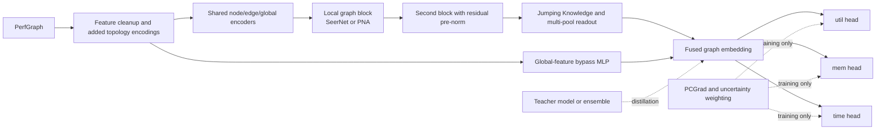
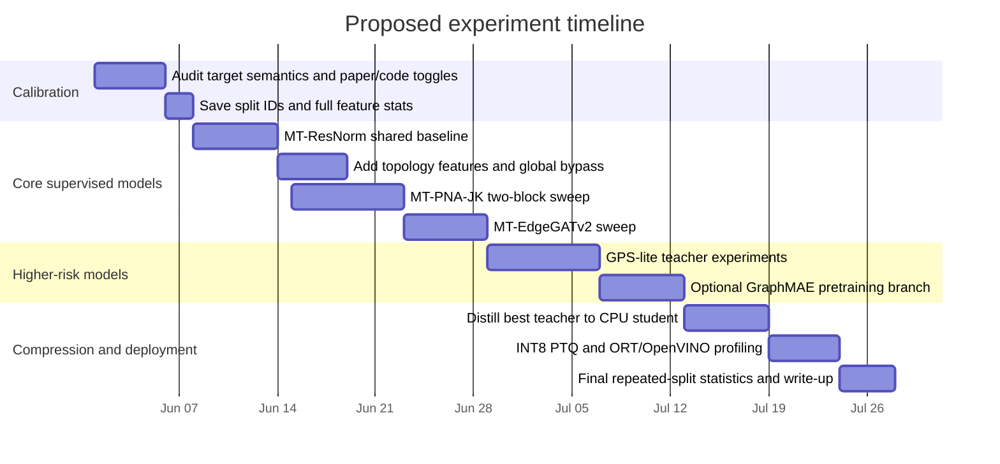

# Accuracy Improvement Report for the PerfSeer-Derived Predictor

## Executive Summary

Your current predictor is already strong: the repository trains **six independent single-output SeerNet models**, each with **hidden size 256** and **one SeerBlock**, and the latest full run reaches **3.898% mean MAPE** across the six targets. That is materially better than the **5.14% mean MAPE** reported for SeerNet in the PerfSeer paper, which means future work should be judged against **your current code baseline**, not against the paper baseline. The main weakness in the present run is not average memory prediction but the two **time** targets, which remain the hardest outputs. fileciteturn0file1 fileciteturn0file0

The most promising path is **not** to jump immediately to a radically different model family. The highest-value sequence is: first, resolve the current paper-vs-code ambiguities that can distort comparisons; second, move from six separate predictors to a **shared multi-task trunk** with **PCGrad** and **learned task weighting**; third, add **normalization, dropout, and deeper-but-controlled message passing** using **PNA-style aggregation** and **Jumping Knowledge**; and only then test higher-risk options such as **edge-aware attention** or a **GraphGPS-lite hybrid**. This ordering follows both PerfSeer’s own ablations—where feature choice mattered more than architectural ornamentation—and broader GNN evidence showing that deeper graph models benefit from normalization, residual design, and multi-scale readouts. fileciteturn0file0 citeturn0academia1turn25academia1turn26academia1turn11academia3

Because inference must run on CPU, the best research strategy is a **teacher–student pipeline**: let the best accuracy-oriented teacher be somewhat heavier during GPU training, then **distill** it into a much smaller shared-head student for CPU deployment. That is a better fit than naïvely shrinking the deployed model, especially because PyTorch dynamic quantization directly targets large **Linear** layers, and ONNX Runtime/OpenVINO both provide mature INT8 paths for CPU inference. citeturn23academia0turn8view1turn29view0turn28view2turn28view1

The realistic upside, given that the current baseline is already very strong, is **incremental rather than dramatic**: a carefully tuned shared model with better topology features and stronger message passing has a plausible path to reducing mean MAPE into the **~3.4–3.8%** range on the current IID split, with most of the gain likely concentrated in **train_time** and **infer_time**. The more valuable improvement may actually be a **better error profile**—especially better ranking and lower tail error for time metrics—while **dramatically reducing deployed CPU footprint**. This is an inference from your baseline error pattern, PerfSeer’s ablations, and the deployment constraints you gave. fileciteturn0file1 fileciteturn0file0

## Current Model and Main Limitations

The current implementation can be summarized compactly as follows.

| Aspect | Current state |
|---|---|
| Representation | PerfGraph with node features `x ∈ R^30`, edge features `edge_attr ∈ R^5`, global features `u ∈ R^18` |
| Backbone | SeerNet-style message-passing model with shared hidden size `256` |
| Depth | `1` SeerBlock |
| Readout | Global-node softmax pooling plus SynMM-style graph aggregation |
| Output strategy | **6 separate models**, each predicting one metric |
| Training target space | MSE on standardized `log1p(y)` targets |
| Per-model size | `1,263,107` params |
| Deployed-equivalent size | `7,578,642` params for six models, about **30.3 MB** in fp32 weights |
| Best reported test result | **3.898% mean MAPE** |
| Hardest metrics | `train_time` 5.606%, `infer_time` 5.521% |
| Strongest metrics | `train_mem` 2.008%, `infer_mem` 2.131% |

All of those values come from your current model structure report. fileciteturn0file1

That baseline is strong, but it has five important limitations.

First, the deployed model family is **wasteful for CPU inference** because it repeats the same encoders and graph reasoning **six times** instead of sharing one trunk. PerfSeer already proposed a multi-metric extension, **SeerNet-Multi**, because the targets are related and separate models are inefficient; its paper used **PCGrad** to mitigate gradient conflict across tasks. Your current code does not use that route yet. fileciteturn0file1 fileciteturn0file0 citeturn0academia2

Second, the current implementation is likely **under-regularized**. The report explicitly notes the absence of **LayerNorm, BatchNorm, dropout, weight decay, and residual scaling**. That matters if you want to move beyond one block, because deeper GNNs often degrade without explicit anti-oversmoothing design. Recent theory and experiments support the idea that **residual connections plus normalization** are not just conveniences; they are among the core mechanisms that stop graph representations from collapsing as depth increases. fileciteturn0file1 citeturn11academia3turn26academia1turn12academia0

Third, the representation still has unresolved **paper-vs-code mismatches**. Your report flags that the code includes **operator-type one-hot channels**, while the paper’s ablation says node categories reduced accuracy and were excluded; it also notes ambiguity around whether the edge-update MLP should consume the graph-global vector `u`, and it points out unresolved differences in **time target semantics**, **target transforms**, and **checkpointed normalization state**. Those issues can move results enough to invalidate architecture comparisons if they are not controlled first. fileciteturn0file1 fileciteturn0file0

Fourth, the current edge representation is probably too weak for the hardest outputs. The report says edge features are derived only from the **source node output tensor metadata**, while PerfSeer’s paper already showed that edge features, although less important than node and global features, still contribute measurable accuracy. For execution-time prediction, especially on branch-heavy DAGs, source-only tensor metadata is unlikely to be the whole story. fileciteturn0file1 fileciteturn0file0

Fifth, the current evaluation protocol is excellent as a reproduction baseline but incomplete for your scheduling use case. The paper and the repo use **MAPE, RMSPE, and x%Acc** with a random **2:1:1** split, which is appropriate for cross-paper comparison. But your intended use is **CPU-side scheduling of GPU jobs**, where **ordering accuracy on time metrics** can matter as much as absolute regression error. The present setup does not yet test that directly. fileciteturn0file1 fileciteturn0file0

## Structural Changes That Are Most Likely to Help

The broad lesson from PerfSeer is that **representation quality dominates**. Its own ablations showed very large gains from adding better node and global features, while SynMM and GNPB then added smaller but still real gains on top. In other words, once a competent graph model is in place, the next significant improvements usually come from **better inductive bias, better feature use, and better objective coupling**, rather than blindly increasing width. fileciteturn0file0

### Most promising low-risk changes

The first structural change I would make is a **shared multi-task trunk** with **small task-specific heads**. PerfSeer already demonstrated that multi-metric prediction is feasible, and PCGrad provides a principled way to resolve conflicting gradients. I would go further than the paper by combining **PCGrad** with **homoscedastic uncertainty weighting** for the six losses, because learned task weights often outperform fixed hand-tuned scalars in multi-task regression. This is especially appropriate here because your six targets have different units, ranges, and noise characteristics. fileciteturn0file0 citeturn0academia2turn26academia2turn14academia0

The second low-risk change is to keep the SeerNet family but introduce **pre-normalized residual blocks**, **mild dropout**, and **AdamW**. For graph-level tasks, **GraphNorm** is a particularly strong candidate because it was explicitly proposed to accelerate GNN optimization and improve generalization, while recent theory reinforces the importance of normalization for deep graph stacks. That said, you should also test **LayerNorm**, because ONNX Runtime can apply **Layer Normalization fusion** on CPU during extended graph optimization, which may make it the better deployment choice if accuracy is statistically tied. citeturn26academia1turn11academia3turn22view1

A third low-risk change is to add a **global-feature bypass tower**. PerfSeer’s ablations showed that global features contribute a very large share of the final accuracy once node features are present. In the current architecture, those features are mixed into message passing, but there is no strong guarantee that a narrow graph trunk preserves their signal cleanly. A separate MLP over the handcrafted global statistics—fused late with the graph embedding through a learned gate—would let the graph branch learn relational corrections while preserving the strongest handcrafted predictors. Recent runtime-prediction work such as **ScaleDL** also points in this direction by combining graph interaction modeling with nonlinear layerwise/global modeling, rather than forcing the graph branch to do everything alone. fileciteturn0file0 citeturn31academia0

A fourth low-risk change is to redesign the feature interface rather than simply widening the current one. The most important additions, in my view, are **DAG-topology features** that PerfSeer does not appear to use explicitly: node depth from inputs and from outputs, in-degree and out-degree, fan-out reuse, longest-path criticality, per-level width statistics, branch/join markers, and edge shape deltas from source to destination. PerfSeer, Graphormer, and GraphGPS all support the same core idea from different angles: **structural encodings matter** for graph-level prediction, and they matter even more when the task depends on execution dependencies rather than only on node attributes. These engineered topological features should be especially helpful for **time** and **utilization** because they better expose graph parallelism and critical path structure. fileciteturn0file0 citeturn10academia1turn0academia0

### Higher-upside model-family changes

The most plausible accuracy-oriented successor to SynMM is a **PNA-style SeerNet** with **Jumping Knowledge** across two blocks. PNA’s main point is exactly relevant to your problem: for graphs with **continuous features**, relying on a single aggregation statistic is often insufficient, and combining multiple aggregators with degree-aware scaling is more expressive. Since SynMM already mixes **max** and **mean**, PNA is a natural generalization rather than a conceptual departure. Adding **Jumping Knowledge** then lets the final readout combine one-hop and two-hop relational evidence without forcing the model to commit to a single effective neighborhood depth, which is valuable for compute DAGs where some performance effects are local and others propagate farther. citeturn0academia1turn25academia1turn12academia0

The next family I would test is **edge-aware dynamic attention**, specifically a local **GATv2/EGAT-inspired** replacement for the edge-to-node aggregation. GATv2 fixed a known limitation of original GAT while keeping matched parametric cost, and EGAT showed that edge features can be carried through the attention mechanism rather than treated as static side information. For your task, not every incoming edge should affect the destination equally: some edges carry large tensor transfers or join high-cost branches, while others are relatively unimportant. Dynamic edge-aware attention is therefore a good fit if the remaining error after PNA/JK is concentrated in `train_time` and `infer_time`. The tradeoff is a higher constant-factor CPU cost than mean/max pooling, so I would classify this as **medium risk, medium-to-high upside**. citeturn24academia0turn24academia1

The highest-upside but highest-risk option is a **GraphGPS-lite hybrid**: one local message-passing block plus one lightweight global-attention block, together with DAG-specific positional encodings. GraphGPS argues that the strongest graph transformers are modular combinations of **local message passing**, **global attention**, and **structural/positional encodings**, and it explicitly emphasizes scalability. Graphormer similarly argues that transformer performance on graphs depends heavily on structural encodings. For compute DAGs, that would translate into a sparse or low-rank global-attention mechanism over nodes, augmented with depth, shortest/longest path, and branch-distance encodings. I would test this only after the low-risk path has plateaued, because even a lightweight global-attention layer will raise CPU inference cost and may not beat a well-tuned PNA/JK model on this dataset. citeturn0academia0turn10academia1

One optional branch is **self-supervised pretraining on the same graphs**, followed by supervised fine-tuning. This is still consistent with your “same dataset” constraint because it does not introduce new labeled data. A **GraphMAE**-style masked-feature pretraining task is well matched to your graph setting and could help if grouped or family-holdout splits reveal generalization gaps. I would not prioritize it ahead of the supervised changes above, because you already have **53k+** labeled graph/metric pairs and a very strong IID baseline, but it is a credible hedge against OOD brittleness. fileciteturn0file0 citeturn27academia0turn27academia3

### Modification matrix

| Change | Why it fits your problem | Estimated effect on mean MAPE | CPU inference implication |
|---|---|---:|---|
| Calibration audit of time semantics and paper/code toggles | Removes hidden confounders before architecture search | **0.0 to 0.4** absolute improvement, plus cleaner science | None |
| Shared multi-task trunk + PCGrad + learned task weights | Exploits cross-target correlation; slashes repeated computation | **0.0 to 0.3** | Large model-stage speedup |
| GraphNorm/LayerNorm + dropout + AdamW | Enables deeper blocks without collapse or overfit | **0.1 to 0.3** | Tiny cost; possibly neutral after fusion |
| Global bypass tower + topology/parallelism features | Preserves high-signal global stats and exposes DAG structure | **0.1 to 0.4** | Negligible incremental cost |
| PNA-style aggregation + JK over two blocks | More expressive aggregation over continuous graph features | **0.2 to 0.5** | Moderate cost increase per shared model |
| Edge-aware GATv2 block | Lets the model prioritize critical incoming edges | **0.1 to 0.4** | Moderate-to-high constant-factor cost |
| GPS-lite hybrid | Adds selective long-range interactions and richer structure use | **0.2 to 0.6** | Highest CPU risk unless distilled |
| Teacher ensemble + distillation | Recovers accuracy in a smaller CPU student | Preserves most teacher gains | Strongest deployment payoff |

The first four rows are driven directly by your current report and PerfSeer’s ablations; the latter rows are motivated by primary GNN papers on PNA, JK, GATv2/EGAT, and GraphGPS/Graphormer. The numeric improvement ranges are pre-experiment estimates, not measured outcomes. fileciteturn0file1 fileciteturn0file0 citeturn0academia1turn25academia1turn24academia0turn24academia1turn0academia0turn10academia1

### Variant comparison table

The table below compares proposed model variants against the **current deployed six-model system**. FLOPs and CPU latency are shown **relative to the current deployed setup**, because the report does not include average graph sizes needed to estimate absolute per-graph FLOPs.

| Variant | Expected mean MAPE | Params | Relative model FLOPs | Relative CPU model-stage latency | Notes |
|---|---:|---:|---:|---:|---|
| Current six-model baseline | **3.898** | **7.58M** | **1.00x** | **1.00x** | Actual measured accuracy |
| MT-ResNorm | 3.7–4.0 | 1.26M | ~0.17x | ~0.17–0.25x | Shared trunk; same SeerBlock family |
| MT-PNA-JK | 3.5–3.9 | ~1.4–1.7M | ~0.20–0.30x | ~0.25–0.40x | Best accuracy/cost balance candidate |
| MT-EdgeGATv2 | 3.5–3.9 | ~1.6–1.9M | ~0.25–0.40x | ~0.35–0.55x | Better if time errors remain dominant |
| GPS-lite teacher | 3.4–3.8 | ~1.8–2.4M | ~0.35–0.70x | ~0.50–1.00x | High-risk, likely teacher not deployable as-is |
| Distilled CPU student | 4.0–4.4 | 0.32–0.50M | ~0.05–0.10x | ~0.08–0.15x | Best deployment option after teacher search |

The baseline parameter count and accuracy come from your current report. The shared-head exact parameter counts can be derived from the current module breakdown; for the unchanged one-block SeerNet family, a six-output shared-head model at `h=256` is about **1.26M** parameters instead of **7.58M** deployed today. The other rows are architecture-based estimates. fileciteturn0file1

## Ablation and Experimental Protocol

Because your current baseline already beats the paper, the experimental design should separate **paper-calibration questions** from **true architecture improvements**. I would treat those as two different phases rather than mixing them in one large sweep. fileciteturn0file1 fileciteturn0file0

### Baselines and split strategy

Start with four mandatory baselines: the current six-model repo baseline; a **paper-faithful toggle matrix** that resolves the known ambiguities; a shared-trunk **vanilla multitask SeerNet**; and the proposed **MT-ResNorm** model. Only after those are stable should you branch into **MT-PNA-JK**, **MT-EdgeGATv2**, **GPS-lite**, and the final **distilled CPU student**. This ordering keeps the science interpretable and avoids the common failure mode of attributing gains to a new architecture when they actually came from fixing a label or feature mismatch. fileciteturn0file1

For data splits, preserve the current **2:1:1** random split with seed 42 so that every experiment remains directly comparable to the repo and the PerfSeer paper. Then add two robustness tracks: a **five-seed repeated IID split** and a **grouped OOD split** where entire architecture families or graph-signature clusters are held out. PerfSeer’s dataset spans a wide range of architectures and FLOP scales, so an IID result alone is not enough if the model will schedule unseen jobs. fileciteturn0file1 fileciteturn0file0

### Metrics and decision rules

Keep the paper-compatible metrics as the primary scoreboard: **mean MAPE**, **per-target MAPE**, **RMSPE**, **5%Acc**, and **10%Acc**. Add three scheduler-relevant secondary metrics: **MAE in original units** for the two time targets, **Spearman ρ or Kendall τ** on `train_time` and `infer_time`, and **top-k scheduling regret** or pairwise ordering accuracy on job runtimes. The first set preserves comparability; the second set aligns model selection with how you actually plan to use the predictions. fileciteturn0file1 fileciteturn0file0

For statistical validity, do not rely on a single best seed. Report **95% bootstrap confidence intervals** on the fixed test split, and use a **Bayesian hierarchical comparison** or at least a repeated-split paired comparison for final model selection across seeds and split variants. Benavoli and Corani et al. make a strong case that Bayesian multi-dataset/multi-run comparisons are more informative than thresholded NHST alone, especially when several models are practically close. citeturn17academia1turn17academia0

### Hyperparameter ranges and ablation axes

| Axis | Values to test | Why it matters |
|---|---|---|
| Time target semantics | raw `time`; `time × batch_size` | Current report says semantics are unresolved |
| Operator feature handling | one-hot on; removed; learned embedding/gated | The paper said categories hurt; current code still includes them |
| Edge update input | with `u_graph`; without `u_graph` | Paper/code ambiguity |
| Depth and width | `(1,256)`, `(2,192)`, `(2,224)`, `(3,160)` | Better relational depth at modest deployed size |
| Normalization | none; GraphNorm; LayerNorm | Depth stabilization and CPU deployment tradeoff |
| Aggregation | SynMM; PNA; PNA+JK | Generalization of multi-aggregator readout |
| Attention | none; local GATv2; EGAT-style | Whether edge-aware weighting helps time outputs |
| Loss design | equal MSE; uncertainty-weighted; +PCGrad; +ranking aux | Multi-task stability and scheduler alignment |
| Regularization | dropout `0/0.05/0.1/0.15`; weight decay `0/1e-5/1e-4/5e-4` | Overfit control |
| Pretraining | none; GraphMAE pretrain | Optional OOD-robustness path |
| Distillation | off; output distill; output+embedding distill | CPU student quality |

The baseline optimizer and schedule should remain close to the repo at first—Adam/AdamW, learning rate around `1e-3` or `3e-4`, batch size `128`, ReduceLROnPlateau, max `500` epochs, and early stopping—because your current pipeline is already known to converge well. Expand the search only after the structural axes above are isolated. fileciteturn0file1 fileciteturn0file0

## Implementation Details and Pseudocode

A practical default architecture is shown below.



This design preserves the core PerfSeer intuition—node, edge, global, and topology all matter—but modernizes it toward a deployment-efficient multitask predictor. It is supported by PerfSeer’s ablations, PNA’s multi-aggregator argument, JK’s multi-scale readout, and current multi-task optimization methods. fileciteturn0file0 citeturn0academia1turn25academia1turn0academia2turn26academia2

### Capacity scaling formulas

For the **current unchanged one-block SeerNet family**, the report’s module breakdown implies the following parameter formulas:

- **single-output model:** `P(h) = 19h² + 70h + 3`
- **shared six-output head:** `P_mt(h) = 19h² + 75h + 8`
- **two-block shared six-output model:** `P_2b(h) = 37h² + 86h + 9`

So, for example, a **two-block shared model at `h=192`** would be about **1.38M** parameters—still far below the **7.58M** deployed-equivalent size of today’s six independent one-block models. That is one reason I prefer **depth-with-sharing** over **wider independent models**. fileciteturn0file1

### Pseudocode for MT-ResNorm

```python
class MTResNormSeer(nn.Module):
    def __init__(self, node_dim, edge_dim, global_dim, hidden=256, num_blocks=2):
        super().__init__()
        self.node_enc = nn.Linear(node_dim, hidden)
        self.edge_enc = nn.Linear(edge_dim, hidden)
        self.global_enc = nn.Linear(global_dim, hidden)

        self.global_bypass = nn.Sequential(
            nn.Linear(global_dim, hidden // 2),
            nn.ReLU(),
            nn.Dropout(0.1),
            nn.Linear(hidden // 2, hidden),
        )

        self.blocks = nn.ModuleList([
            SeerOrPNABlock(hidden=hidden, norm="graphnorm", dropout=0.1)
            for _ in range(num_blocks)
        ])

        self.jk_gate = nn.Linear(hidden * num_blocks, hidden)
        self.fuse = nn.Sequential(
            nn.Linear(hidden * 2, hidden),
            nn.ReLU(),
            nn.Dropout(0.1),
        )

        self.heads = nn.ModuleDict({
            "train_util": nn.Sequential(nn.Linear(hidden, 128), nn.ReLU(), nn.Linear(128, 1)),
            "train_mem":  nn.Sequential(nn.Linear(hidden, 128), nn.ReLU(), nn.Linear(128, 1)),
            "train_time": nn.Sequential(nn.Linear(hidden, 128), nn.ReLU(), nn.Linear(128, 1)),
            "infer_util": nn.Sequential(nn.Linear(hidden, 128), nn.ReLU(), nn.Linear(128, 1)),
            "infer_mem":  nn.Sequential(nn.Linear(hidden, 128), nn.ReLU(), nn.Linear(128, 1)),
            "infer_time": nn.Sequential(nn.Linear(hidden, 128), nn.ReLU(), nn.Linear(128, 1)),
        })

    def forward(self, data):
        v = self.node_enc(data.x)
        e = self.edge_enc(data.edge_attr)
        u = self.global_enc(data.u)
        z = softmax_global_node_init(v, data.batch)

        layer_graph_embeds = []
        for block in self.blocks:
            v, e, u, z = block(v, e, u, z, data.edge_index, data.batch)
            layer_graph_embeds.append(u)

        jk = torch.cat(layer_graph_embeds, dim=-1)
        graph_embed = self.jk_gate(jk)
        bypass = self.global_bypass(data.u)
        fused = self.fuse(torch.cat([graph_embed, bypass], dim=-1))

        return {name: head(fused) for name, head in self.heads.items()}
```

### Pseudocode for the PNA-JK block

```python
class SeerOrPNABlock(nn.Module):
    def __init__(self, hidden, norm="graphnorm", dropout=0.1):
        super().__init__()
        self.edge_mlp = MLP(4 * hidden, hidden, hidden)
        self.node_mlp = MLP(4 * hidden, hidden, hidden)  # agg + node + z + u
        self.global_node_mlp = MLP(hidden, hidden, hidden)
        self.global_mlp = MLP(3 * hidden, hidden, hidden)
        self.dropout = nn.Dropout(dropout)
        self.norm_v = GraphOrLayerNorm(hidden, kind=norm)
        self.norm_e = GraphOrLayerNorm(hidden, kind=norm)
        self.norm_u = nn.LayerNorm(hidden)

    def pna_aggregate(self, msgs, degree):
        mu = scatter_mean(msgs, degree.index, dim=0)
        mx = scatter_max(msgs, degree.index, dim=0)
        sd = scatter_std(msgs, degree.index, dim=0)
        agg = torch.cat([mu, mx, sd], dim=-1)
        return degree_scale(agg, degree.value)

    def forward(self, v, e, u, z, edge_index, batch):
        src, dst = edge_index
        e_msg = self.edge_mlp(torch.cat([e, v[src], v[dst], u[batch[src]]], dim=-1))
        e = e + self.dropout(self.norm_e(e_msg))

        deg = in_degree(dst, num_nodes=v.size(0))
        agg = self.pna_aggregate(e, DegreeInfo(dst, deg))
        node_in = torch.cat([agg, v + z, u[batch]], dim=-1)
        v_new = self.node_mlp(node_in)
        v = v + self.dropout(self.norm_v(v_new))

        z_bar = softmax_pool(v, batch)
        z = z + self.global_node_mlp(z_bar)

        u_bar = synmm_or_pna_graph_pool(v, batch)
        u_new = self.global_mlp(torch.cat([u_bar, z_graph(z, batch), u], dim=-1))
        u = u + self.dropout(self.norm_u(u_new))
        return v, e, u, broadcast(z, batch)
```

### Pseudocode for training with PCGrad, uncertainty weighting, ranking loss, and distillation

```python
def multitask_train_step(model, teacher, batch, optimizer, pcgrad, log_vars, lambda_rank=0.05, lambda_kd=0.2):
    preds = model(batch)
    with torch.no_grad():
        teacher_preds = teacher(batch) if teacher is not None else None

    task_losses = {}
    for name, pred in preds.items():
        y = batch.targets[name]

        # base supervised loss in standardized log space
        mse_log = F.mse_loss(pred, y)

        # relative-error robust term for time metrics
        if "time" in name:
            pred_orig = inv_log_standardize(pred, batch.stats[name])
            y_orig = inv_log_standardize(y, batch.stats[name])
            rel = (pred_orig - y_orig) / torch.clamp(y_orig, min=1e-6)
            robust = F.huber_loss(rel, torch.zeros_like(rel), delta=0.05)
            rank = pairwise_rank_loss(pred_orig, y_orig)
            loss = mse_log + 0.5 * robust + lambda_rank * rank
        else:
            loss = mse_log

        # task uncertainty weighting
        s = log_vars[name]
        loss = torch.exp(-s) * loss + s

        # teacher-student regression distillation
        if teacher_preds is not None:
            kd = F.mse_loss(pred, teacher_preds[name].detach())
            loss = loss + lambda_kd * kd

        task_losses[name] = loss

    pcgrad.backward(list(task_losses.values()))
    optimizer.step()
    optimizer.zero_grad()
    return {k: v.item() for k, v in task_losses.items()}
```

Two implementation details are worth making non-negotiable. Save the **full feature normalization statistics and split identifiers** with every checkpoint, because the current repo restores only target statistics; and make the **time target definition** (`raw_time` vs `time_times_batch`) an explicit configuration field so that experiments are auditably comparable. Both recommendations follow directly from the reproducibility risks documented in your current report. fileciteturn0file1

## CPU Inference Strategy

The CPU strategy should be designed around the fact that, in the PerfSeer paper, **representation extraction dominated prediction latency**.

| Stage | Reported CPU latency in PerfSeer |
|---|---:|
| Representation (graph extraction / PerfGraph construction) | ~248 ms |
| SeerNet prediction | ~2.0 ms |
| SeerNet-Multi prediction | ~2.1 ms |
| Total usage overhead | ~250 ms |

If your scheduling loop extracts the graph online every time, **caching PerfGraph or its normalized tensors is more important than shaving a few milliseconds off the neural net**. If the graph is already cached, then model-stage optimizations become much more meaningful. fileciteturn0file0

### Deployment tactics and tradeoffs

| Tactic | Best use case | Likely upside | Main risk | Recommendation |
|---|---|---|---|---|
| PyTorch dynamic quantization | First CPU optimization pass on Linear-heavy model | Smaller model, low-effort latency reduction | Usually small-to-moderate speedup, not maximal | **Do first** |
| ONNX Runtime static INT8 PTQ | When model-stage latency matters and calibration data is available | Better latency than dynamic in many cases | Accuracy drop if calibration poor | **Do second** |
| OpenVINO PTQ with accuracy control | Intel CPU deployment | Strong CPU path, layer exclusion and accuracy control available | Extra tooling complexity | **Prefer on Intel** |
| QAT | If PTQ loses too much accuracy | Best chance to recover INT8 accuracy | More training complexity | **Do only if needed** |
| Pruning | Storage compression or distillation regularizer | Smaller checkpoints | CPU speedup not guaranteed by itself | **Secondary** |
| Distillation | After best teacher is known | Biggest accuracy/latency balance improvement | Requires extra training stage | **High priority** |
| ORT graph optimization + offline serialization | Production caching / fast startup | Lower startup cost, operator fusion | Requires ahead-of-time export | **Always enable** |
| Thread tuning and microbatching | Bulk queue scoring on CPU | Better throughput | Can hurt single-request latency | **Profile, do not assume** |

The official deployment docs support this ordering. PyTorch’s `quantize_dynamic()` converts float models to **weight-only quantized** versions and explicitly targets modules with large weights such as **Linear** layers, which is a particularly good fit because your SeerNet family is dominated by linear MLPs. ONNX Runtime supports **8-bit linear quantization**, with both **dynamic** and **static** modes; it notes that dynamic quantization is often more accuracy-friendly but adds runtime overhead, whereas static quantization uses calibration data and can reduce inference cost more aggressively. citeturn8view1turn29view0

For ONNX Runtime on CPU, the docs recommend **S8S8 with QDQ** as the default first choice because it balances performance and accuracy; if accuracy drops substantially, U8U8 is the next fallback. ONNX Runtime also recommends doing graph optimization during **pre-processing**, not during quantization, because that makes quantization debugging easier. That is a strong reason to export and cache an optimized model artifact rather than rebuilding the graph in the hot path. citeturn29view0turn22view0turn22view1turn22view2

If you deploy on Intel CPUs, OpenVINO is worth serious consideration. Its **basic PTQ flow** uses a representative **calibration dataset**, supports `target_device=CPU`, lets you exclude layers via **ignored scopes**, and explicitly offers an **accuracy control** flow when the quantized model degrades too much. That makes it a very practical second-stage optimizer after you identify the final student architecture. citeturn28view2turn28view1turn8view4

Pruning should be treated carefully. PyTorch’s pruning utilities are perfectly usable—they support **global unstructured pruning** and a `remove()` call that makes pruning permanent in the model weights—but the tutorial focuses on masks and serialization mechanics, not on guaranteed runtime speedups. In practice, that means pruning is often more reliable as a **storage reduction / regularization aid** or as a precursor to distillation than as a standalone CPU latency optimization, unless your runtime and hardware actually exploit sparsity. citeturn30view2turn30view1

Finally, use ONNX Runtime’s CPU execution settings deliberately. The default CPU execution provider already exposes **intra-op thread control**, **graph optimization levels**, and **sequential vs. parallel execution**; the docs note that `ORT_PARALLEL` can help graphs with many branches but can also hurt some models. Given that compute DAGs differ widely in branching structure, you should profile `{sequential, parallel} × {physical_cores/2, physical_cores}` on representative workloads rather than hard-coding one policy. citeturn21view0

## Prioritized Roadmap and Timeline

The roadmap below is ordered by expected value under your exact constraints: same dataset, CPU inference, freedom to modify components, and a practical scheduling use case.

| Priority | Work package | Estimated effort | Expected effect | Risk |
|---|---|---:|---|---|
| Highest | **Calibration audit** of time semantics, op categories, edge-update input, checkpointed feature stats | 3–5 days | Cleaner comparisons; possible 0.0–0.4 mean-MAPE gain | Low |
| Highest | Build **MT-ResNorm** shared-trunk baseline with PCGrad and uncertainty weighting | 4–6 days | Similar or slightly better accuracy with far cheaper CPU inference | Low–medium |
| High | Add **global bypass** and **topology/parallelism features** | 3–5 days | Most likely low-cost accuracy gain on time metrics | Low |
| High | Train **MT-PNA-JK** two-block model | 5–7 days | Best accuracy/cost balance candidate | Medium |
| Medium | Test **MT-EdgeGATv2** if time metrics still dominate residual error | 4–6 days | Time-metric improvement potential | Medium–high |
| Medium | Test **GPS-lite** teacher | 5–8 days | Highest upside, but real CPU risk | High |
| High | **Distill** best teacher into small shared student, then int8 optimize | 4–7 days | Biggest deployment payoff | Medium |
| Medium | Final CPU profiling with ORT/OpenVINO, thread tuning, and microbatching | 2–4 days | Production-ready latency/throughput envelope | Low |

These estimates are based on your current code structure, the paper’s ablations, and the deployment paths documented by PyTorch, ONNX Runtime, and OpenVINO. The implied decision rule is: stop escalating model complexity once **grouped-split time-metric gains** flatten or once a smaller distilled student stays within your practical error tolerance. fileciteturn0file1 fileciteturn0file0 citeturn8view1turn29view0turn28view2turn21view0



### Unstated assumptions that should be made explicit

- I assume **“same dataset”** means no new labeled graphs may be added, but **self-supervised pretraining, loss reweighting, and distillation on the same graph corpus are allowed**.
- I assume the goal is **practical predictor quality for scheduling**, not a strict paper-faithful reproduction. If strict reproduction matters, the calibration audit becomes stage zero and should not be skipped. fileciteturn0file1
- I assume **CPU inference** refers mainly to the predictor network itself; if **PerfGraph extraction** is also online, then caching graph extraction is a first-order systems problem because PerfSeer’s own paper reported representation latency that dwarfed model latency. fileciteturn0file0
- I assume future workloads are broadly similar to the current dataset. If not, **grouped family holdouts and ranking-based scheduler metrics** should dominate model selection more than IID mean MAPE.